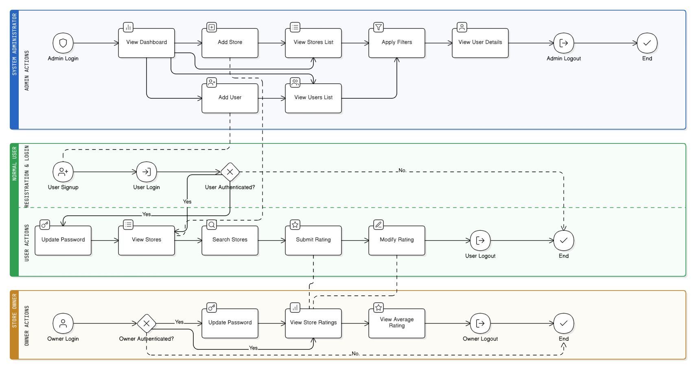

# Store Rating System

A comprehensive web application for managing store ratings with role-based access control. Users can register, browse stores, submit ratings, while store owners can manage their stores and administrators have full system oversight.

## 🏗️ System Architecture



The system follows a modern client-server architecture with:
- **Frontend**: React.js single-page application
- **Backend**: Node.js/Express REST API
- **Database**: MySQL relational database
- **Authentication**: JWT token-based authentication
- **UI Framework**: Bootstrap for responsive design

## 🚀 Tech Stack

### Frontend
- **React 19.1.1** - Modern JavaScript library for building user interfaces
- **React Router DOM 7.8.2** - Declarative routing for React
- **React Bootstrap 2.10.10** - Bootstrap components for React
- **Axios 1.11.0** - HTTP client for API requests
- **Bootstrap 5.3.8** - CSS framework for responsive design

### Backend
- **Node.js** with **Express 5.1.0** - Web application framework
- **MySQL2 3.14.5** - MySQL client for Node.js
- **JWT 9.0.2** - JSON Web Token implementation
- **bcryptjs 3.0.2** - Password hashing
- **CORS 2.8.5** - Cross-origin resource sharing

### Development Tools
- **Nodemon** - Auto-restart for backend development
- **Create React App** - React application boilerplate
- **Testing Library** - React testing utilities

## 📋 Prerequisites

Before running this application, make sure you have the following installed:
- **Node.js** (v16 or higher)
- **MySQL** (v8.0 or higher)
- **npm** or **yarn** package manager
- **Git** for version control

## 🛠️ Installation & Setup

### 1. Clone the Repository
```bash
git clone https://github.com/rushikeshpatil9891/StoreRating.git
cd StoreRating
```

### 2. Backend Setup

```bash
# Navigate to backend directory
cd Backend

# Install dependencies
npm install

# Set up database
# Make sure MySQL is running, then:
node config/init-db.js

# Start the backend server
npm run dev  # Development mode with auto-restart
# OR
npm start    # Production mode
```

**Backend will run on:** `http://localhost:5000`

### 3. Frontend Setup

```bash
# Navigate to frontend directory (from project root)
cd Frontend/store_rating

# Install dependencies
npm install

# Create environment file (if needed)
# The frontend uses relative API calls, so no additional config usually needed

# Start the development server
npm start
```

**Frontend will run on:** `http://localhost:3000`

### 4. Default Admin Account

After setting up the database, you can log in with the default admin account:

- **Email:** `admin@storerating.com`
- **Password:** `admin123`

This admin account is created automatically during database initialization and has full system access.

## 🔧 Environment Configuration

### Backend (.env file)

The application supports both **local** and **cloud** databases. Choose the appropriate configuration:

#### For Local MySQL Database (Offline):
```env
DB_HOST=localhost
DB_USER=root
DB_PASSWORD=your_mysql_password
DB_NAME=store_rating_db
DB_SSL=false
```

#### For Cloud Database (Online - Aiven, AWS RDS, etc.):
```env
DB_HOST=your_cloud_db_host
DB_PORT=3306
DB_USER=your_cloud_db_user
DB_PASSWORD=your_cloud_db_password
DB_NAME=store_rating_db
DB_SSL=true
DB_SSL_CA=ca.pem
```

**Note:** Your `.env` file contains both configurations. To switch between local and cloud databases:

1. **For Local Development:** Keep the "LOCAL DATABASE" section uncommented and the "CLOUD DATABASE" section commented
2. **For Production/Cloud:** Comment out the "LOCAL DATABASE" section and uncomment the "CLOUD DATABASE" section

### Switching Between Environments

```bash
# For local development (default)
# Keep DB_SSL=false and local settings

# For cloud deployment
# Uncomment cloud settings and set DB_SSL=true
# Make sure ca.pem certificate file is present
```

### Frontend (if needed)
Create a `.env` file in the frontend directory:
```env
REACT_APP_API_URL=http://localhost:5000/api
```

## 📁 Project Structure

```
StoreRating/
├── Backend/                    # Node.js/Express API
│   ├── config/
│   │   ├── database.js        # Database connection
│   │   ├── init-db.js         # Database initialization
│   │   └── schema.sql         # Database schema
│   ├── controllers/           # Business logic
│   │   ├── authController.js
│   │   ├── userController.js
│   │   ├── storeController.js
│   │   ├── ratingController.js
│   │   ├── dashboardController.js
│   │   └── activityLogController.js
│   ├── middleware/
│   │   └── auth.js            # Authentication middleware
│   ├── models/                # Data models
│   │   ├── User.js
│   │   ├── Store.js
│   │   ├── Rating.js
│   │   └── ActivityLog.js
│   ├── routes/                # API routes
│   │   ├── auth.js
│   │   ├── users.js
│   │   ├── stores.js
│   │   ├── ratings.js
│   │   ├── dashboard.js
│   │   └── activityLogs.js
│   ├── index.js               # Main server file
│   ├── package.json
│   └── README.md
│
├── Frontend/                   # React.js application
│   └── store_rating/
│       ├── public/
│       │   ├── index.html
│       │   ├── manifest.json
│       │   └── System-Arch.png    # Architecture diagram
│       ├── src/
│       │   ├── components/        # Reusable UI components
│       │   │   ├── Layout.jsx
│       │   │   ├── Login.jsx
│       │   │   ├── Navigation.jsx
│       │   │   ├── Register.jsx
│       │   │   └── ...
│       │   ├── contexts/
│       │   │   └── AuthContext.js # Authentication context
│       │   ├── pages/            # Page components
│       │   │   ├── Dashboard.jsx
│       │   │   ├── StoresList.jsx
│       │   │   ├── UserManagement.jsx
│       │   │   └── ...
│       │   ├── services/
│       │   │   └── api.js        # API service layer
│       │   ├── utils/
│       │   ├── App.jsx          # Main app component
│       │   ├── index.js         # App entry point
│       │   └── ...
│       ├── package.json
│       └── README.md
│
└── README.md                   # This file
```

## 🎯 Features

### User Management
- **User Registration & Authentication** - Secure signup/login with JWT
- **Role-based Access Control** - Admin, Store Owner, and Normal User roles
- **Profile Management** - Update user information and preferences

### Store Management
- **Store CRUD Operations** - Create, read, update, delete stores
- **Store Search & Filtering** - Find stores by various criteria
- **Store Ownership** - Store owners can manage their stores

### Rating System
- **Star Rating** - 1-5 star rating system
- **Rating History** - View all ratings for a store
- **User Ratings** - Users can rate stores and view their rating history
- **Rating Analytics** - Statistics and insights on ratings

### Dashboard & Analytics
- **Role-specific Dashboards** - Different views for different user types
- **Statistics & Reports** - Comprehensive analytics for admins
- **Activity Monitoring** - Track user activities and system usage

### Security Features
- **JWT Authentication** - Secure token-based authentication
- **Password Hashing** - bcrypt for secure password storage
- **Input Validation** - Comprehensive validation on all inputs
- **CORS Protection** - Cross-origin resource sharing configuration

## 🔗 API Endpoints

### Authentication
- `POST /api/auth/register` - User registration
- `POST /api/auth/login` - User login
- `GET /api/auth/profile` - Get user profile
- `PUT /api/auth/profile` - Update user profile

### Users (Admin)
- `GET /api/users` - List all users
- `POST /api/users` - Create user
- `PUT /api/users/:id` - Update user
- `DELETE /api/users/:id` - Delete user

### Stores
- `GET /api/stores` - List stores with search/filters
- `POST /api/stores` - Create store
- `PUT /api/stores/:id` - Update store
- `DELETE /api/stores/:id` - Delete store

### Ratings
- `POST /api/ratings` - Submit rating
- `GET /api/ratings/store/:id` - Get store ratings
- `GET /api/ratings/user` - Get user's ratings
- `DELETE /api/ratings/:store_id` - Delete rating

### Dashboard
- `GET /api/dashboard` - Get dashboard data
- `GET /api/dashboard/admin` - Admin dashboard
- `GET /api/dashboard/store-owner` - Store owner dashboard

## 🧪 Testing

### Backend Testing
```bash
cd Backend
npm test
```

### Frontend Testing
```bash
cd Frontend/store_rating
npm test
```

## 🚀 Deployment

### Backend Deployment
1. Set production environment variables
2. Run database migrations
3. Start the server with `npm start`

### Frontend Deployment
1. Build the production bundle:
   ```bash
   cd Frontend/store_rating
   npm run build
   ```
2. Serve the `build` folder using a web server (nginx, Apache, etc.)

## 🤝 Contributing

1. Fork the repository
2. Create a feature branch (`git checkout -b feature/amazing-feature`)
3. Commit your changes (`git commit -m 'Add amazing feature'`)
4. Push to the branch (`git push origin feature/amazing-feature`)
5. Open a Pull Request

## 📝 License

This project is licensed under the ISC License.
